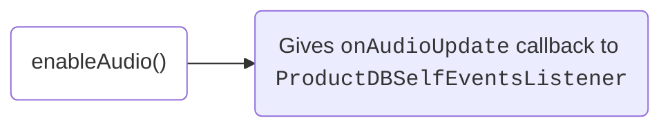
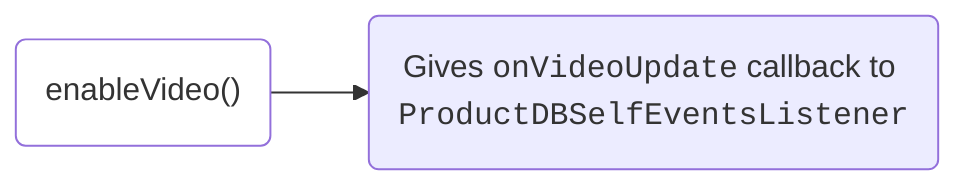

# Media Preview

Before joining a meeting, users may want to preview and configure their media devices like camera, microphone, and audio output.
This section provides developers with the tools to prepare the media environment before joining a ProductDB meeting.

If you are using our UI Kits, this functionality can be handled by `ProductDBSetupScreen` or built with `ProductDBParticipantTile` widget.

## Properties

- `ProductDBMobileClient.localUser.audioEnabled`: A <span className="tag-orange">boolean</span> value indicating if the audio currently enabled.
- `ProductDBMobileClient.localUser.videoEnabled`: A <span className="tag-orange">boolean</span> value indicating if the video currently enabled.

## Methods

### Toggling Media

The same methods used for controlling media during a meeting are also applicable for pre-call media configuration.

**1. Mute/Unmute microphone**

```dart
// Mute Audio
ProductDBMobileClient.localUser.disableAudio()

// Unmute Audio
ProductDBMobileClient.localUser.enableAudio()

```



<br />

Anytime there is an update in the audio state of the local user, the Core SDK notifies the client through the `onAudioUpdate` callback
from `ProductDBSelfEventsListener`. Here's how you can register the listener:

```dart
class SelfAudioNotifier extends ProductDBSelfEventsListener{
    override fun onAudioUpdate(bool audioEnabled) {
    // Show local user's VideoView if video is enabled
    }
}

ProductDBMobileClient.addSelfEventsListener(SelfAudioNotifier())
```

**2. Enable/Disable camera**

```dart
// Disable Video
ProductDBMobileClient.localUser.disableVideo()

// Enable Video
ProductDBMobileClient.localUser.enableVideo()
```



<br />

Whenever there is an update in the video state of the local user, the Core SDK notifies the client through the `onVideoUpdate` callback
from `ProductDBSelfEventsListener`. Here's how you can register the listener:

```dart
class SelfVideoNotifier extends ProductDBSelfEventsListener{
    override fun onVideoUpdate(bool videoEnabled) {
        // Show local user's VideoView if video is enabled
    }
}

ProductDBMobileClient.addSelfEventsListener(SelfVideoNotifier());
```

### Changing Media Device

Media devices represent the hardware for the camera, microphone, and speaker devices. To get the list of media devices currently
available, use the following methods:

```dart
// Get all audio devices
final audioDevices = ProductDBMobileClient.localUser.getAudioDevices()

// Get all video devices
final videoDevices = ProductDBMobileClient.localUser.getVideoDevices()
```

To get the currently selected media device, use the following methods:

```dart
// Get current audio device being used
final currentAudioDevice = ProductDBMobileClient.localUser.getSelectedAudioDevice()

// Get current video device being used
final currentVideoDevice = ProductDBMobileClient.localUser.getSelectedVideoDevice()
```

Use these methods to create a UI that allows users to configure their media devices. When the user selects a device, use the below methods to set the device.

**Set device**

```kotlin
// Set audio device
ProductDBMobileClient.localUser.setAudioDevice(device)
// eg. device = audioDevices[0]

// Set video device
ProductDBMobileClient.localUser.setVideoDevice(device)
// eg. device = videoDevices[0]
```
