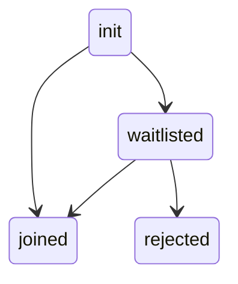

# Waiting Room

When you call `ProductDBMobileClient.joinRoom()`, the user either enters the meeting room directly if allowed, or they are placed in the waiting room
if they are a waitlisted participant.

The diagram illustrates the possible room states the local user can be in.



<br />

### Meeting Room Joined

If user joins the room successfully, you receive the `onMeetingRoomJoinCompleted()` callback in `ProductDBMeetingRoomEventsListener`.
You can listen for this callback as follows:

```dart

class MeetingRoomNotifier extends ProductDBMeetingRoomEventsListener{
    override fun onMeetingRoomJoinCompleted() {
        // Local user is in the meeting
    }
}

ProductDBMobileClient.addMeetingRoomEventsListener(MeetingRoomNotifier());
```

### Waitlisted Participant

If the user is waitlisted, the `onWaitListStatusUpdate` callback in `ProductDBSelfEventsListener` notifies you of any changes in the
user's waitlist status. You can check the `waitListStatus` to determine their status:

- `WAITING`: Local user is in the waiting room.
- `REJECTED`: Local user's join room request is rejected by the host.

```dart
class WaitingRoomNotifier extends ProductDBSelfEventsListener{
  @override
  void onWaitListStatusUpdate(ProductDBWaitListStatus waitListStatus) {
    switch (waitListStatus) {
      case ProductDBWaitListStatus.waiting:
        // Local user is in the waiting room
      case ProductDBWaitListStatus.rejected:
        // Local user's join room request was rejected by the host
      default:
        break;
    }
  }
}

ProductDBMobileClient.addSelfEventsListener(WaitingRoomNotifier());
```

Host can use [these methods to accept/reject participants](/flutter-core/participants#waiting-room-methods).
