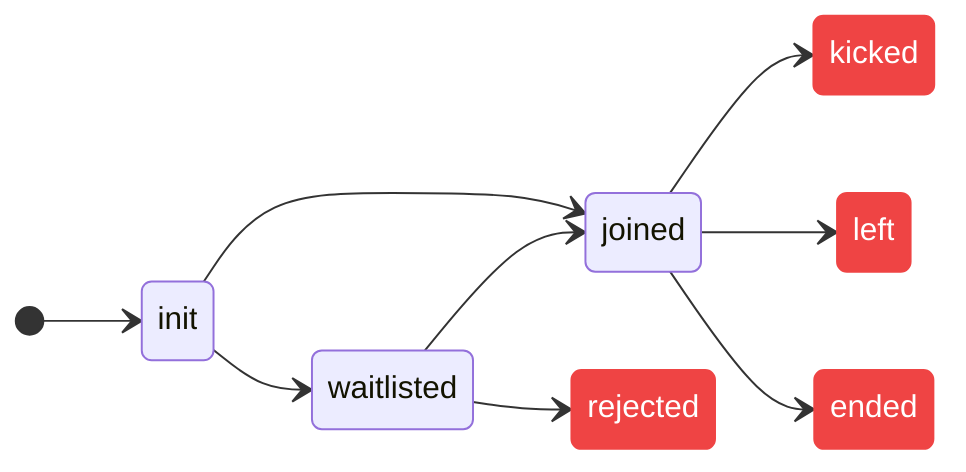

<!-- Auto Generated Below -->

<a name="module_ProductDBSelf"></a>

The ProductDBSelf module represents the current user, and allows to modify the state
of the user in the meeting. The audio and video streams of the user can be retrieved from
this module.

:::tip Note
ProductDBSelf extends [ProductDBSelfMedia](./ProductDBSelfMedia) therefore all the methods & variables exposed by ProductDBSelfMedia are also available on ProductDBSelf.

Few examples:
```tsx
meeting.self.rawAudioTrack;
meeting.self.rawVideoTrack;
meeting.self.audioEnabled;
meeting.self.videoEnabled;
await meeting.self.getAudioDevices();
await meeting.self.getVideoDevices();
```
:::

* [ProductDBSelf](#module_ProductDBSelf)
    * [.roomState](#module_ProductDBSelf+roomState)
    * [.permissions](#module_ProductDBSelf+permissions)
    * [.config](#module_ProductDBSelf+config)
    * [.roomJoined](#module_ProductDBSelf+roomJoined)
    * [.isPinned](#module_ProductDBSelf+isPinned)
    * [.setName(name)](#module_ProductDBSelf+setName)
    * [.setupTracks(options)](#module_ProductDBSelf+setupTracks)
    * [.enableAudio()](#module_ProductDBSelf+enableAudio)
    * [.enableVideo()](#module_ProductDBSelf+enableVideo)
    * [.updateVideoConstraints()](#module_ProductDBSelf+updateVideoConstraints)
    * [.enableScreenShare()](#module_ProductDBSelf+enableScreenShare)
    * [.updateScreenshareConstraints()](#module_ProductDBSelf+updateScreenshareConstraints)
    * [.disableAudio()](#module_ProductDBSelf+disableAudio)
    * [.disableVideo()](#module_ProductDBSelf+disableVideo)
    * [.disableScreenShare()](#module_ProductDBSelf+disableScreenShare)
    * [.getAllDevices()](#module_ProductDBSelf+getAllDevices)
    * [.setIsPinned()](#module_ProductDBSelf+setIsPinned)
    * [.pin()](#module_ProductDBSelf+pin)
    * [.unpin()](#module_ProductDBSelf+unpin)


<a name="module_ProductDBSelf+roomState"></a>

### self.roomState
Returns the current state of room
- init - Inital State
- joined - User is in the meeting
- waitlisted - User is in the waitlist state
- rejected - User's was in the waiting room, but the entry was rejected
- kicked - A priveleged user removed the user from the meeting
- left - User left the meeting
- ended - The meeting was ended




<a name="module_ProductDBSelf+permissions"></a>

### self.permissions
Returns the current permission given to the user for the meeting.

<a name="module_ProductDBSelf+config"></a>

### self.config
Returns configuration for the meeting.

<a name="module_ProductDBSelf+roomJoined"></a>

### self.roomJoined
Returns true if the local participant has joined the meeting.

<a name="module_ProductDBSelf+isPinned"></a>

### self.isPinned
Returns true if the current user is pinned.


<a name="module_ProductDBSelf+setName"></a>

### self.setName(name)
The name of the user can be set by calling this method.
This will get reflected to other participants ONLY if
this method is called before the room is joined.


| Param | Description |
| --- | --- |
| name | Name of the user. |

<a name="module_ProductDBSelf+setupTracks"></a>

### self.setupTracks(options)
Sets up the local media tracks.


| Param | Description |
| --- | --- |
| options | The audio and video options. |
| options.video | If true, the video stream is fetched. |
| options.audio | If true, the audio stream is fetched. |

<a name="module_ProductDBSelf+enableAudio"></a>

### self.enableAudio()
This method is used to unmute the local participant's audio.

<a name="module_ProductDBSelf+enableVideo"></a>

### self.enableVideo()
This method is used to start streaming the local participant's video
to the meeting.

<a name="module_ProductDBSelf+updateVideoConstraints"></a>

### self.updateVideoConstraints()
This method is used to apply constraints to the current video
stream.

<a name="module_ProductDBSelf+enableScreenShare"></a>

### self.enableScreenShare()
This method is used to start sharing the local participant's screen
to the meeting.

<a name="module_ProductDBSelf+updateScreenshareConstraints"></a>

### self.updateScreenshareConstraints()
This method is used to apply constraints to the current screenshare
stream.

<a name="module_ProductDBSelf+disableAudio"></a>

### self.disableAudio()
This method is used to mute the local participant's audio.

<a name="module_ProductDBSelf+disableVideo"></a>

### self.disableVideo()
This participant is used to disable the local participant's video.

<a name="module_ProductDBSelf+disableScreenShare"></a>

### self.disableScreenShare()
This method is used to stop sharing the local participant's screen.

<a name="module_ProductDBSelf+getAllDevices"></a>

### self.getAllDevices()
Returns all media devices accessible by the local participant.

<a name="module_ProductDBSelf+setIsPinned"></a>

### self.setIsPinned()
<a name="module_ProductDBSelf+pin"></a>

### self.pin()
Returns `self.id` if user has permission
to pin participants.

<a name="module_ProductDBSelf+unpin"></a>

### self.unpin()
Returns `self.id` if user has permission
to unpin participants.

<a name="module_ProductDBSelf+setDevice"></a>

### self.setDevice(device)
Change the current media device that is being used by the local participant.


| Param | Description |
| --- | --- |
| device | The device that is to be used. A device of the same `kind` will be replaced. the primary stream. |

<a name="module_ProductDBSelf+requestToJoinStage"></a>

### ~~self.requestToJoinStage()~~
***Deprecated***

<a name="module_ProductDBSelf+withdrawRequestToJoinStage"></a>

### ~~self.withdrawRequestToJoinStage()~~
***Deprecated***

<a name="module_ProductDBSelf+leaveStage"></a>

### ~~self.leaveStage()~~
***Deprecated***

<a name="module_ProductDBSelf+joinStage"></a>

### ~~self.joinStage()~~
***Deprecated***

<a name="module_ProductDBSelf+setWebinarStageStatus"></a>

### ~~self.setWebinarStageStatus()~~
***Deprecated***

<a name="module_ProductDBSelf+disablePreview"></a>

### ~~self.disablePreview()~~
***Deprecated***

<a name="module_ProductDBSelf+clientSpecificId"></a>

### ~~self.clientSpecificId~~
***Deprecated***

<a name="module_ProductDBSelf+suggestedTheme"></a>

### ~~self.suggestedTheme~~
***Deprecated***

<a name="module_ProductDBSelf+webinarStageStatus"></a>

### ~~self.webinarStageStatus~~
***Deprecated***